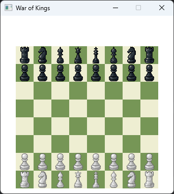
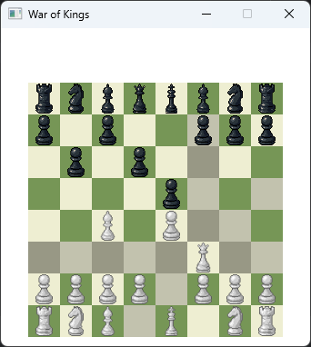

# ♛ War of Kings

**War of Kings** é um jogo de **xadrez clássico** (1 contra 1) desenvolvido em **Java**, utilizando **JavaFX** para a interface gráfica. O projeto oferece uma experiência completa e fiel às regras tradicionais do xadrez, com foco em partidas locais e uma interface amigável e responsiva.

---

## 🎮 Visão Geral

O objetivo principal do projeto é proporcionar partidas de xadrez locais entre dois jogadores humanos, com um tabuleiro interativo, lógica de regras completamente implementada e possibilidade de futuras expansões como modo online ou contra IA.

### 🔍 Funcionalidades Atuais

- ♟️ Tabuleiro 8x8 totalmente funcional
- ✅ Implementação completa das regras do xadrez clássico:
    - Movimentos válidos para todas as peças
    - Promoção de peões
    - Roque
    - Xeque e xeque-mate
    - Detecção de empate (em breve)
- 🎨 Destaque visual para casas selecionadas e possíveis jogadas
- 🎯 Indicação de xeque e xeque-mate com cores distintas
- 🖱️ Controle de peças por clique
- 🪟 Interface gráfica feita com JavaFX

---

## 🛠️ Tecnologias Utilizadas

| Tecnologia   | Descrição                             |
|--------------|----------------------------------------|
| Java         | Lógica principal do jogo               |
| JavaFX       | Interface gráfica do usuário           |
| Gradle       | Gerenciamento e build do projeto       |
| Git / GitHub | Controle de versão e colaboração       |

---

## 🗺️ Organização do Tabuleiro

O tabuleiro é representado por uma matriz 8x8 onde as posições seguem o padrão:

```
[[00, 01, 02, ..., 07],
 [10, 11, 12, ..., 17],
 ...
 [70, 71, 72, ..., 77]]
```

Exemplo: A posição `43` indica linha 4, coluna 3. Isso permite movimentos usando operações matemáticas diretas:
- Para cima: `-10`
- Para baixo: `+10`
- Para esquerda: `-1`
- Para direita: `+1`
- Diagonais: `±9`, `±11`

---

## 📌 Status do Projeto

- ✅ Jogo local totalmente funcional
- 🚧 Sistema de IA (em planejamento)
- 🚧 Multiplayer online (em estudo)
- 🚧 Menu de configurações e reinício de partidas (em planejamento)

---

## 👥 Colaboradores

| Nome            | GitHub                                      |
|-----------------|---------------------------------------------|
| Lucas Nóbrega   | [@lucrasn](https://github.com/lucrasn)      |
| Allan Guilherme | [@allangrm](https://github.com/allangrm)    |
| Beatriz Matos   | [@beamatss](https://github.com/beamatss)    |
| Lívia Ferreira  | [@livdenner](https://github.com/livdenner)  |
| Raffael Wagner  | [@Raffael-Wagner](https://github.com/Raffael-Wagner) |

---

## 🚀 Como Executar

1. Clone o repositório:
   ```bash
   git clone https://github.com/seu-usuario/war-of-kings.git
   ```
2. Abra com sua IDE Java (IntelliJ, Eclipse etc.)
3. Certifique-se de estar com o Java 21 e JavaFX configurado.
4. Execute a classe principal (ex: `HelloApplication.java`).

---

## 📷 Capturas de Tela (opcional)




---

## 📄 Licença

Distribuído sob a licença MIT. Veja `LICENSE` para mais informações.

---